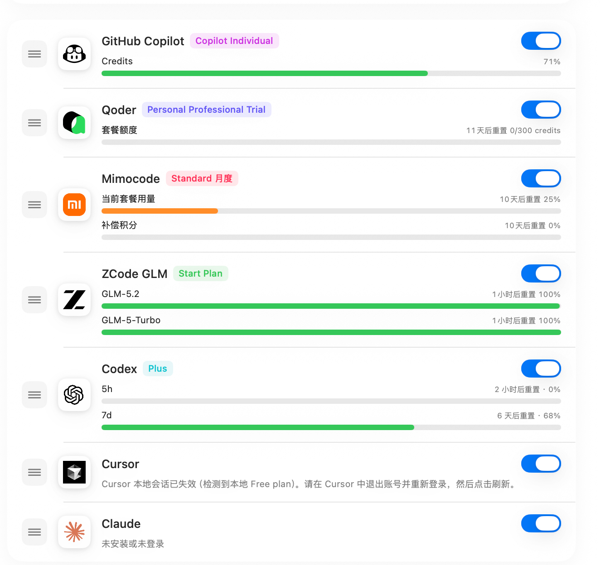
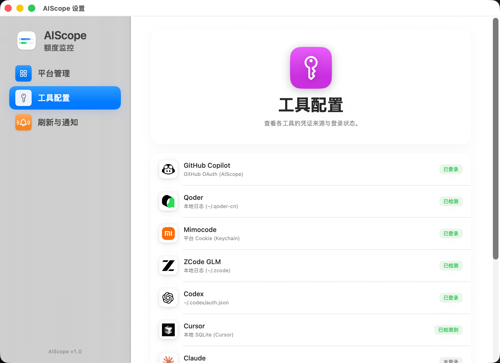
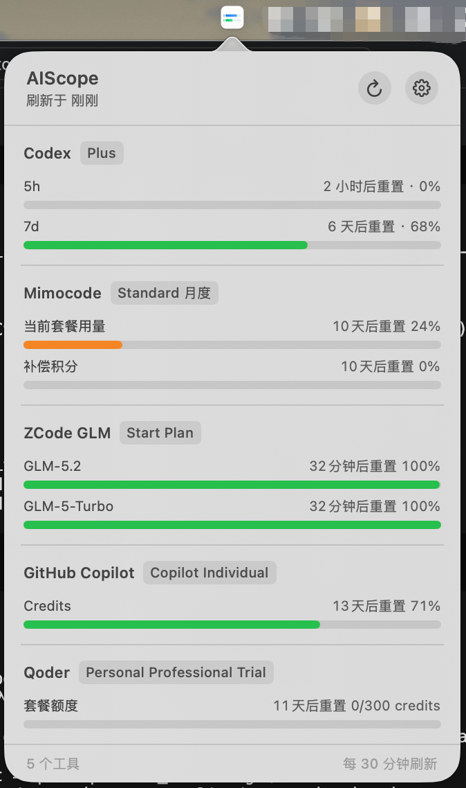

# AIScope

AIScope 是一款 macOS 菜单栏应用，用于监控本地账号下各 AI 编程工具的额度和使用情况。

它读取支持工具的本地登录状态，通过各工具 API 获取用量数据，并在菜单栏中展示简洁的额度仪表盘。凭证保存在本地机器上，存储在 macOS 钥匙串或原始工具配置文件中。

## 支持的工具

- Cursor
- Claude Code
- GitHub Copilot
- OpenAI Codex
- Mimo
- Qoder
- ZCode

## 应用截图

### 菜单栏与额度展示


### 工具配置


### 状态栏下拉框


## 系统要求

- macOS 14.0 或更高版本
- Xcode 16 或更高版本
- Swift 6

## 项目结构

```text
.
├── AIScope/
│   ├── App/                        # 应用入口和 AppKit 桥接
│   ├── Assets.xcassets/            # 应用和工具图标
│   ├── Models/                     # 共享数据模型和设置
│   ├── Providers/                  # 各工具额度提供者
│   ├── Resources/                  # Info.plist 和权限配置
│   ├── Services/                   # 钥匙串、SQLite、数据刷新
│   └── Views/                      # SwiftUI 界面
├── AIScope.xcodeproj/              # Xcode 项目
├── LICENSE
├── project.yml                     # XcodeGen 项目定义
└── README.md
```

## 构建

在 Xcode 中打开 `AIScope.xcodeproj`，运行 `AIScope` scheme。

命令行构建：

```bash
DEVELOPER_DIR=/Applications/Xcode.app/Contents/Developer \
xcodebuild \
  -project AIScope.xcodeproj \
  -scheme AIScope \
  -configuration Debug \
  -derivedDataPath /tmp/AIScopeDerivedData \
  CODE_SIGNING_ALLOWED=NO \
  build
```

## 隐私

AIScope 不运行后端服务。工具凭证从本地文件或 macOS 钥匙串读取，统一的应用凭证存储在 `AIScope.Credentials` 钥匙串项中。

额度请求直接从应用发送到各工具的官方或本地兼容接口。

## 开发说明

- 在 `AIScope/Providers/` 下添加新工具。
- 在 `DataManager.allProviders` 中注册工具。
- 保持工具 ID 稳定，它们用于设置、缓存和显示顺序。
- 保持个人 Xcode 状态不提交到版本库。根目录 `.gitignore` 已排除 `xcuserdata` 和 `*.xcuserstate`。

## 工具配置说明

### Cursor
- **自动检测**：在 Cursor 中登录账号后，AIScope 会自动检测并读取额度
- **凭证来源**：`~/Library/Application Support/Cursor/User/globalStorage/state.vscdb`
- **前提条件**：安装 Cursor 并登录账号

### Claude Code
- **自动检测**：安装 Claude Code CLI 并登录后，AIScope 会自动检测
- **凭证来源**：macOS 钥匙串（服务名 `Claude Code-credentials`）
- **前提条件**：安装 Claude Code CLI 并运行 `claude login`
- **注意**：claude.ai、Claude Desktop、Claude Code 共享同一套餐额度

### GitHub Copilot
- **手动登录**：在设置页面点击"登录 GitHub"，完成授权后自动刷新
- **凭证来源**：AIScope 自己的 GitHub OAuth 登录态
- **前提条件**：拥有 GitHub Copilot 订阅

### OpenAI Codex
- **自动检测**：安装 Codex CLI 并登录后，AIScope 会自动检测
- **凭证来源**：macOS 钥匙串或 `~/.codex/auth.json`
- **前提条件**：安装 Codex CLI 并登录 ChatGPT 账户

### Mimo
- **手动登录**：在设置页面点击"登录 MiMo"，完成浏览器授权后自动刷新
- **凭证来源**：`~/.local/share/mimocode/auth.json` + 平台 Cookie
- **前提条件**：安装 Mimo 并拥有 Token Plan 订阅

### Qoder
- **自动检测**：安装 Qoder 后，AIScope 会自动检测本地状态
- **凭证来源**：`~/.qoder-cn` 或 `~/.qoder-cli` 目录
- **前提条件**：安装 Qoder CN 或 Qoder CLI 并登录

### ZCode
- **自动检测**：安装 ZCode 后，AIScope 会自动检测并实时获取额度
- **凭证来源**：`~/.zcode/v2/config.json` 中的 API Key
- **前提条件**：安装 ZCode 并登录 Z.ai 账号
- **特点**：直接调用 Z.ai API 获取实时数据，不依赖本地日志，打开电脑即可看到最新额度
